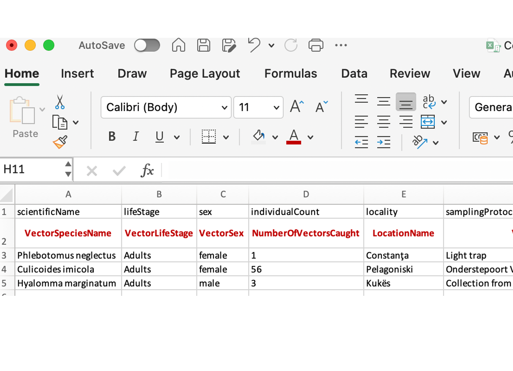
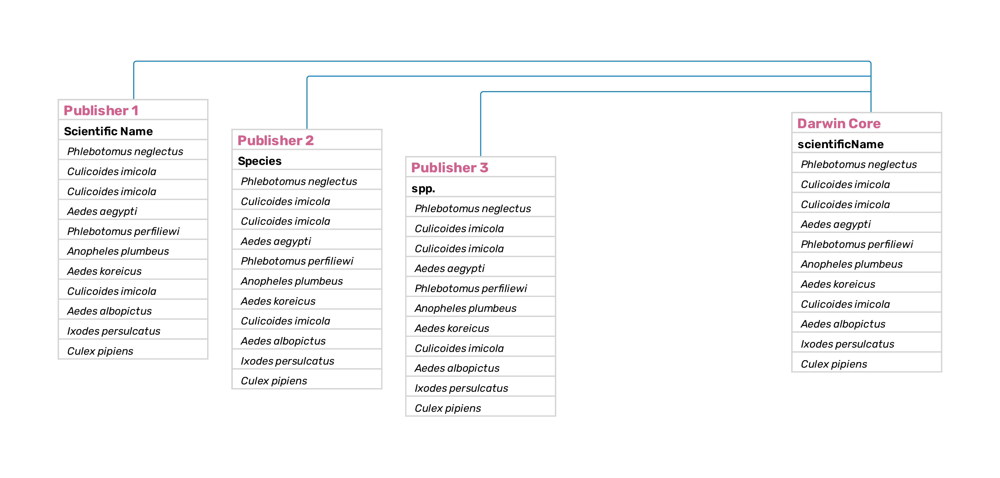

=== Steps to publish a dataset in GBIF

Anyone interested in publishing a dataset in GBIF can do so by registering an organization - GBIF only publishes datasets from individuals affiliated to an organization. Please check the page on how to https://www.gbif.org/become-a-publisher[become a publisher^] and the https://www.gbif.org/publishing-data[quick guide to publishing data through GBIF^].

The next step is to prepare the data into files that will be published as Darwin Core Archives (see https://www.gbif.org/standards[data standards^]), prior to publication is important to perform a data cleaning step and prepare the metadata, once the data is uploaded in an IPT, the data holder must select one of the three licences used by GBIF and then, the dataset can be published and registered as a resource in GBIF. Figure 1 summarizes the basic steps to data publication in GBIF.

[#fig-01]
.A simplified flow for data publishing in GBIF. Steps will be referred to in the text below with a link to the appropriate sections in this guide.
image::/img/web/fig-01.png[]

==== Choose a dataset class

There are four https://www.gbif.org/dataset-classes[dataset classes^] that are supported for publication in GBIF: metadata-only datasets, checklist, occurrence, and sampling-event datasets. For more information, please check https://data-blog.gbif.org/post/choose-dataset-type[how to choose a dataset class on GBIF^]

For more details on data categorization, please check data-categorization[section 2^] of this guide.

==== Data cleaning and mapping the data to the DwC standard

Once a dataset class is selected, the data must be transformed to comply with a https://www.gbif.org/darwin-core[[.underline]#data standard#] that is accepted in GBIF, the most widely used standard in biodiversity is the https://www.tdwg.org/standards/dwc/[[.underline]#Darwin Core Standard#], there are over 180 Darwin Core https://dwc.tdwg.org/terms/[[.underline]#terms#] that are stable and provide vocabularies related to organisms and their related data. Most terms cover the wide range of variables present in vector collection, but some variables, such as environmental, genomic data, among others are best represented by https://rs.gbif.org/extensions.html[[.underline]#extensions#], which are sets of terms corresponding to a specific category of data.

It is considered best practice to make a copy of the original data file to be transformed into a structured dataset, which is a table with headers in the first row and with no colours, comments, no merged cells or extra formatting, no macros. Unknown, absent and/or missing data must be left as blank cells, *DO NOT USE* N/A or zero, ? or anything else.

Data transformation follows a set of steps necessary to format some terms, i.e. dates must follow ISO 8601 and geographical coordinates must be in decimal degrees, then we map the original column headers in the spreadsheet to Darwin Core terms. It is during this step that data cleaning and data quality checks can be performed, this step can be performed in any spreadsheet software such as Excel, LibreOffice or Modern CSV or with dedicated software such as https://openrefine.org/[[.underline]#OpenRefine#].

[fig-02]
.Example of DwC mapping to the original headers in a table. Suggested Darwin Core terms are mapped in the first row, original headers in the second row and examples are given in the following three rows.

[[table-01]]
.Date formatting under the ISO 8601 standard. Left column, original data in different formats; middle column, dates formatted using the ISO 8601 standard.
[width="100%",cols="33%,32%,35%",options="header",]
|===
|*CollectionDate* |*dwc:eventDate* |*ISO 8601*
|3 jan 2002 |2002-01-03 |YYYY-MM-DD
|23/10/04 |2004-10-04 |YYYY-MM-DD
|14-08-95 |1995-08-14 |YYYY-MM-DD
|Dec 2012 |2012-12 |YYYY-MM
|2015 |2015 |YYYY
|23-24/Oct/2004 |2004-10-23/2004-10-24 |YYYY-MM-DD/YYYY-MM-DD
|11/2009 to 12/2009 |2009-11/2009-12 |YYYY-MM/YYYY-MM
|===

[fig-03]
.Mapping species names. In this example, three different publishers refer to species names using different headers (lines 2), when mapping to DwC, species names become the dwc:https://dwc.tdwg.org/terms/#dwc:scientificName[[.underline]#scientificName#] term.

For detailed instructions on mapping vector data to the DwC standard please refer to sections <<2.1>>, <<2.2>> and <<2.3>> below.

=== 1.4.3. Publishing the dataset in the IPT

A dataset is ready to be uploaded in the https://www.gbif.org/ipt[IPT^], the Integrated GBIF's data publishing tool, when it is structured and formatted to Darwin Core. Please check the https://ipt.gbif.org/manual/en/ipt/latest[IPT user manual^] for more information. In the IPT, the user will upload the file, it is possible to map the terms to DwC if this step was not done previously. Next the user will fill out the metadata (see metadata requirements in link:#metadata[[.underline]#section 1.4.4#]), and it is in this section that the user will be requested to https://ipt.gbif.org/manual/en/ipt/latest/applying-license[[.underline]#select a Creative Commons license#]. There are three types of licenses available for the resources:

* https://creativecommons.org/publicdomain/zero/1.0[CC0 1.0^] - data is available for any use without any restrictions
* https://creativecommons.org/licenses/by/4.0[CC BY 4.0^] - data is available for any use with appropriate attribution
* https://creativecommons.org/licenses/by-nc/4.0[CC BY-NC 4.0^] - data is available for any non-commercial use with appropriate
attribution

After filling out the metadata information, the user will need to make the dataset public and publish the dataset, and register the dataset in GBIF.

After publication, a Darwin Core Archive (DwC-A) will be generated, this is a zipped archive consisting of one or more files of data, an XML file (`meta.xml`) describing the contents of the text files and how they relate to each other, and an XML file (`eml.xml`) containing the metadata in EML about the dataset.

Once the dataset is published, GBIF provides a few https://www.gbif.org/dataset/f0ccf436-e2e8-4f61-af19-753cdb73ca00/metrics[metrics^]
on the datasets, https://www.gbif.org/dataset/f0ccf436-e2e8-4f61-af19-753cdb73ca00/activity[user download activity^]
and literature https://www.gbif.org/resource/search?contentType=literature&gbifDatasetKey=f0ccf436-e2e8-4f61-af19-753cdb73ca00[citations^].

=== 1.4.4. Metadata

Metadata is "data that provides information about other data", it will contain descriptive information about a resource, helping users to find relevant information and discover resources, it should inform users on how to access the data, understand its fitness-for-use, and it will provide information about the creator(s), permissions, public licensing, and when and how it was created.

Different metadata standards exist and in GBIF, the Ecological Metadata Language (https://eml.ecoinformatics.org/[[.underline]#EML standard#]), is the standard that records information on the resources using XML document types.

A metadata file will be generated once the required information is entered in the metadata section of the IPT metadata editor and it will be included in the DwC-A file. This is an https://api.gbif.org/v1/dataset/83ab030b-d243-469c-8947-1ed487e06a80/document[example^] of a XML metadata file.

The IPT presents 12 different metadata forms, but some, such as associated parties, collection data, external links and additional metadata are not required.

The required terms for the IPT metadata editor are presented below with examples.

[[table-02]]
.Metadata terms based in the GBIF https://rs.gbif.org/schema/eml-gbif-profile/1.3[EML schema^] with vector-related examples, and status based on the https://ipt.gbif.org/manual/en/ipt/latest/gbif-metadata-profile#validation-of-metadata[metadata fields required by GBIF^] 

`ADD FORMATTED TABLE`

