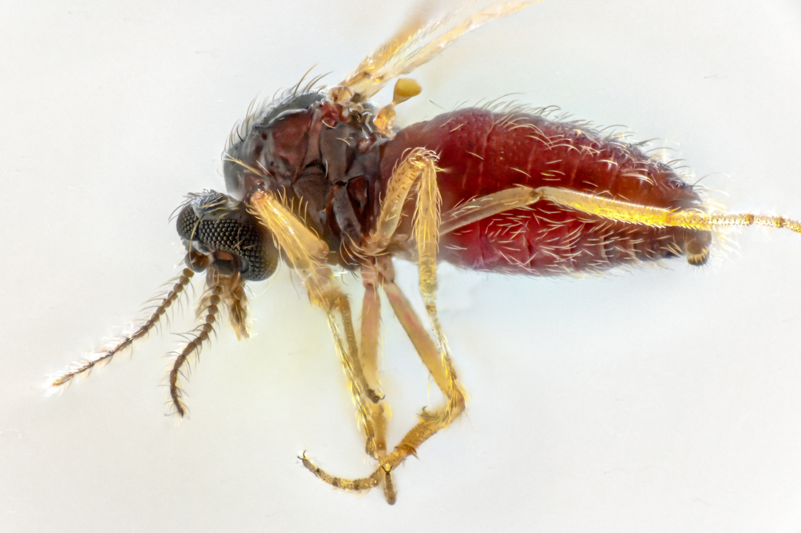

// add cover image to img directory and update filename below
ifdef::backend-html5[]

endif::backend-html5[]

== Colophon

=== Suggested citation

Shimabukuro PHF, Campbell L, Fouque F, Etang J, Cecarelli S, Groom Q, Ingenloff K, Svenningsen C, Grosjean M, Martínez JG &  Schigel D (2025) Publishing data on disease vectors, hosts and pathogens through biodiversity data platforms. GBIF Secretariat: Copenhagen. 
// Uncomment once a DOI is assigned
//https://doi.org/10.EXAMPLE/EXAMPLE

=== Authors

http://orcid.org/0000-0002-5114-953X[Paloma Shimabukuro^], [Lindsay Campbell^], [Florence Fouque^], [Josiane Etang^], [Soledad Cecarelli^], [Quentin Groom^], [Kate Ingenloff^], [Cecilie Svenningsen^], [Marie Grosjean^], [Javier Gamboa Martínez^] & [Dmitry Schigel^]
=== Contributors

=== Licence

The document _Publishing data on disease vectors, hosts and pathogens through biodiversity data platforms_ is licensed under https://creativecommons.org/licenses/by-sa/4.0[Creative Commons Attribution-ShareAlike 4.0 Unported License].

=== Persistent URI

#TODO: Assign a DOI before publication#
// Uncomment once a DOI is assigned
//https://doi.org/10.EXAMPLE/EXAMPLE

=== Document control

Community review edition, v0.1, May 2025

=== Cover image

// Caption. Credit, source, licence.
Western honey bee (_Apis mellifera_), Hardy County, Florida, United States. Photo 2018 thebugroomno2 via https://www.gbif.org/occurrence/1945467387[iNaturalist research-grade observations], licensed under http://creativecommons.org/licenses/by-nc/4.0/[CC BY-NC 4.0].
