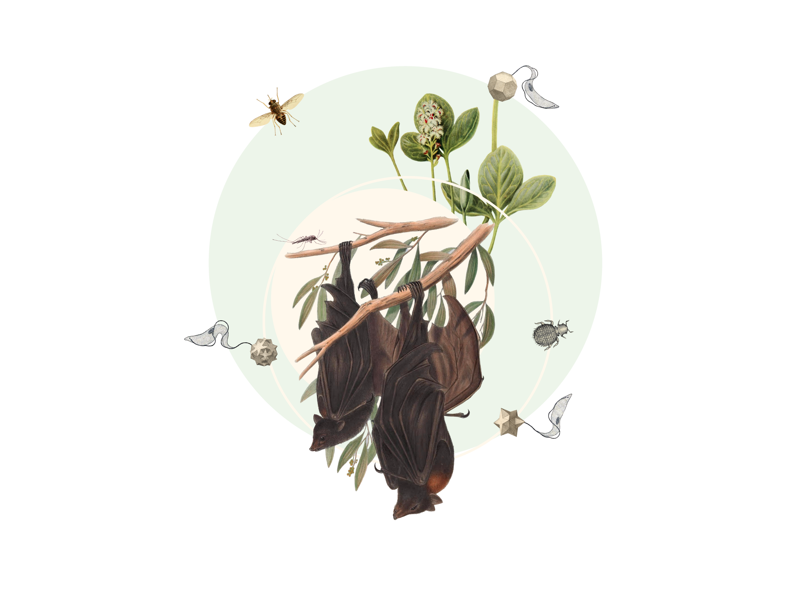

// add cover image to img directory and update filename below
ifdef::backend-html5[]

endif::backend-html5[]

== Colophon

=== Suggested citation

Shimabukuro PHF, Campbell L, Fouque F, Etang J, Cecarelli S, Groom Q, Ingenloff K, Svenningsen C, Grosjean M, Martínez JG & Schigel D (2025) Publishing data on disease vectors, hosts and pathogens through biodiversity data platforms. Copenhagen: GBIF Secretariat. https://doi.org/10.35035/doc-mjj8-ng28

=== Authors

http://orcid.org/0000-0002-5114-953X[Paloma Shimabukuro^], https://orcid.org/0000-0001-6069-1198[Lindsay Campbell^], https://orcid.org/0000-0001-9731-3270[Florence Fouque^], https://orcid.org/0000-0001-8953-0419[Josiane Etang^], https://orcid.org/0000-0002-9790-0157[Soledad Cecarelli^], https://orcid.org/0000-0002-0596-5376[Quentin Groom^], https://orcid.org/0000-0001-5942-9053[Kate Ingenloff^], https://orcid.org/0000-0002-9216-2917[Cecilie Svenningsen^], https://orcid.org/0000-0002-2685-8078[Marie Grosjean^], https://orcid.org/0000-0002-1789-1183[Javier Gamboa Martínez^] & https://orcid.org/0000-0002-2919-1168[Dmitry Schigel^]

=== Licence

The document _Publishing data on disease vectors, hosts and pathogens through biodiversity data platforms_ is licensed under https://creativecommons.org/licenses/by-sa/4.0[Creative Commons Attribution-ShareAlike 4.0 Unported License].

=== Persistent URI

https://doi.org/10.35035/doc-mjj8-ng28

=== Document control

Community review edition, v0.1, May 2025

=== Cover image credit

GBIF Secretariat 2025, licensed under https://creativecommons.org/licenses/by/4.0/[CC BY 4.0]
